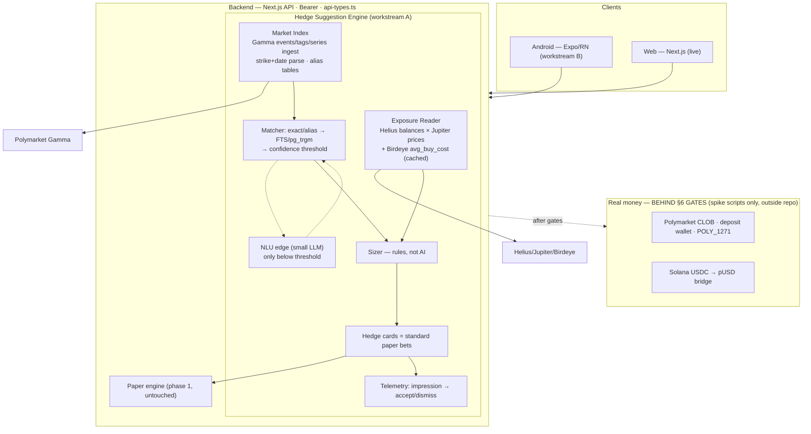

# Hedge Fun — Phase 2 spec (Android + hedge engine on Polymarket)

> Status: **locked 2026-07-17** by the owner after advisor review (GPT Sol 5.6 + Kimi K3, both
> repo-grounded). This doc is the execution contract for phase 2. Sibling docs:
> [`hedge-fun-july-mvp-spec.md`](./hedge-fun-july-mvp-spec.md) (phase 1, as built),
> [`android-readiness.md`](./android-readiness.md), [`share-and-android.md`](./share-and-android.md).

---

## 0. Scope

1. **Android app** (Expo / React Native) — a second client on the same backend API and the same
   Privy identity. No backend fork.
2. **Hedge mechanics** (client request) — wallet hedge + life-event hedge, suggestions matched
   against real Polymarket markets. Ships as **paper bets** through the existing engine until the
   real-money gates (§6) clear.
3. **Real-money rails** (Polymarket CLOB) — **gated**. No real-money code enters this repo until
   §6 confirmations land; de-risking happens in throwaway spike scripts outside the repo.

Liquidity provider decision: **Polymarket** (over Kalshi) — final.

## 1. Decisions (locked, with rationale)

| # | Decision | Rationale |
|---|----------|-----------|
| D1 | **No LLM in the decision loop.** Matching, side selection, sizing, execution — deterministic code. | Polymarket metadata is structured (verified live: tag slugs, event tickers, strike+date in slugs/questions). LLM enumeration (the client's v1 pattern) is slow, expensive, un-QA-able. Advisor consensus. |
| D2 | **LLM = one thin NLU edge only**: a single constrained small-model call mapping free-text → `{category, entities, intent}`, invoked **only** when alias/FTS matching falls below a confidence threshold (scenario 2 free-text path). Logged and replayable. | The one vocabulary problem scripts can't close ("мой клуб" → team alias). ~1 cheap call per hedge request worst-case; LLM API savings fund Birdeye (owner decision). |
| D3 | **Exposure = current market value**, not cost basis. Balances via Helius, prices via Jupiter. | On-chain data cannot reliably reconstruct purchase price (CEX transfers, LPs, airdrops). Both advisors flagged independently. |
| D4 | **`avg_buy_cost` narrative via Birdeye Wallet PnL** (`/wallet/v2/pnl*`), cached in Postgres with TTL, graceful degradation (card renders without the "you bought at $X" line if Birdeye is down). | Solved-as-a-service; free Standard tier covers dev+pilot (30k CU/mo; summary=30 CU, details=40 CU), prod = Lite $39/mo. Wallet APIs are beta and capped 5 rps / 75 rpm on every tier → cache is mandatory, never call synchronously per screen. Fallbacks: Vybe / Cielo / DIY over Helius Enhanced Transactions. |
| D5 | **Custody = client-side silent signing** via Privy embedded wallet: EIP-712 CLOB orders signed on-device with no per-swipe modal; no server-held keys or session delegation. Non-custodial. | Server-side delegation = de-facto custodial (regulatory tail); per-swipe modals kill the swipe UX. Privy supports configurable confirmation UX. |
| D6 | **Hedge cards are standard paper bets** — same `Bet` row, same settlement poller, no separate hedge ledger. | Validates matching quality + conversion with zero custody exposure; weekly shippable. |
| D7 | **Android lives in `mobile/`** in this repo; copies `api-types.ts`, `time.ts`, and the pure builders from `share.ts` (header comment: "copied from src/lib — sync manually"). No monorepo tooling. | Per android-readiness.md: 3 files is a copy, not infrastructure. `share.ts` still contains `process.env`/`window` (Sol's finding) — the **pure builders** transfer, the opener is reimplemented natively. |
| D8 | **Variable stake enters the API contract** (`stakeCents` on hedge bets; regular deck swipes stay fixed $10). | 5–10% notional sizing cannot be expressed in a fixed-$10 flow (Sol's finding on `api-types.ts`). |
| D9 | **Swipe is never blocked by signing or submission** (owner decision 2026-07-18). The swipe gesture resolves instantly and the user keeps swiping; everything after the gesture is an async background pipeline. Paper mode already works this way in both clients (optimistic advance: `src/app/page.tsx`, `mobile/src/screens/DeckScreen.tsx`) — real money MUST preserve it: swipe → enqueue an order intent (market, side, stake, price snapshot) → background worker signs (Privy silent, D5) and submits to the CLOB → per-bet status (`signing → submitting → open/filled/failed`) surfaces in Results, never as a blocking modal. Failures (signing error, network, CLOB reject) show a non-blocking notice with retry; price protection = marketable-limit orders with a max-slippage bound — if the price moved past the bound between gesture and submit, auto-cancel + notify, never fill silently at a worse price. | A signature per swipe is 100ms–1s+ of latency; putting it in the gesture path kills the core UX. The async pipeline is also where slippage policy and retries naturally live. |

## 2. Hedge scenarios (functional)

### S1 — Wallet hedge
- Input: a Solana address (pasted or connected; read-only — we never ask for keys).
- Majors (SOL; wrapped BTC/ETH if present): offer a **5–10% of current notional** position in the
  opposite direction on a matching Polymarket market ("SOL will NOT be above $X by <date>" /
  "below $Y by <date>"). Strike + deadline parsed deterministically from market slug/question.
- Long-tail SPL (no direct markets): sum current value → offer **~3% into a SOL short** as a proxy
  hedge. UI copy must label it a *proxy* (basis risk), not a hedge.
- The "you bought at $X" line comes from Birdeye `avg_buy_cost` when available (D4).
- Sizing percentages are **product rules**, not hedge math — copy must not claim equivalence.

### S2 — Life-event hedge
- **Primary UX: structured pickers** — team / league / event lists built from Polymarket's own
  sports & entertainment metadata (same poller cadence as the deck; lists churn daily).
- **Secondary: free-text** ("иду на фильм X") → alias/FTS match → below threshold → NLU edge (D2)
  → deterministic search + ranking.
- **Fallback** (client-specified): "в твоей уникальной ситуации сложно перестраховаться" + 3
  random markets — labeled **discovery**, never presented as a hedge.
- Scope guard (client-approved): blue-chip crypto + sports (+ entertainment when metadata allows).

### S3 — Stock leg (Stocklana, 2026-09-14)
- A life cost or a wallet holding maps to a **tokenized stock** (xStocks on Solana) instead of a market:
  "$800 on flights this month" → DALx at 10 %; BTC in the wallet → GLDx at 10 %; an energy-basket move
  (XLEx ≥ +5 %) → a **spotted** card for drivers. Deterministic keyword rules first (13 categories,
  EN/RU/UK), the team matcher always runs, the NLU edge only when both miss — see
  `src/lib/hedge/stock-rules.ts` (rules, triggers, copy) and `src/lib/hedge/stock.ts` (cards, accept).
- Accept = a paper lot (`StockPosition`, source HEDGE) + the ACCEPT event in one transaction; the
  on-chain path is the same Phantom + Jupiter swap as the deck. Kinds: `S1-stock`, `S3-stock`, `spotted`.

## 3. Architecture (bird's-eye)



Key invariants:
1. LLM never selects side, size, or execution (D1/D2).
2. Hedge suggestions settle through the existing paper pipeline (D6).
3. Real-money code stays out of the repo until §6 clears.
4. Server remains the single source of truth; clients render `/api/*` responses.

## 4. Workstreams & ownership

| Workstream | Executor | Owned paths | Must not touch |
|---|---|---|---|
| **A — hedge engine (server)** | Opus 4.8 | `src/lib/**` (new hedge modules), `src/app/api/hedge/**`, `prisma/**` (migrations), `scripts/**`, `src/lib/api-types.ts` | `src/app/page.tsx` & web screens (until engine lands), `mobile/**` |
| **B — Android client** | Kimi K3 | `mobile/**` only | everything outside `mobile/` (copies contract files in, never edits originals) |

Contract rule (from android-readiness.md): every new request/response shape lands in
`api-types.ts` (workstream A owns it), every schema change is a committed Prisma migration.
Workstream B consumes copies.

## 5. Data model & env additions (workstream A detail)

- `HedgeWallet` — user_id, address, created_at (read-only address link; multiple allowed later).
- `WalletSnapshot` — cached exposure + Birdeye PnL per address, `fetchedAt` TTL.
- `MarketMeta` — enrichment over the market cache: tags, event slug/ticker, series, parsed strike
  (integer cents), parsed deadline, liquidity/volume (for ranking).
- `HedgeSuggestionEvent` — suggestion id, user, market, kind (S1-major / S1-proxy / S2 / fallback),
  proposed stake, event (impression / accept / dismiss), created_at. **Without this we learn
  nothing** (advisor consensus).
- Bets from hedge cards: standard `Bet` rows + `stakeCents` (D8) + suggestion back-reference.
- Env: `HELIUS_API_KEY`, `BIRDEYE_API_KEY`, `NLU_API_KEY` (NLU edge only, any OpenAI-compatible provider), all in
  `.env.example` with comments. Jupiter price API needs no key at our volumes.

## 6. Real-money gates

Updated **2026-08-12**. Gate 1 is no longer a question to ask Polymarket: the whole architecture
was proven against **production** in a throwaway spike (`poly-spike/`, outside the repo). A Deposit
Wallet was deployed for a fresh signer from builder API credentials alone, $2 was bridged in from
Solana, trading approvals were set, and a live CLOB order signed by that wallet with `POLY_1271` and
our builder code was accepted and then cancelled.

| # | Gate | Status |
|---|---|---|
| 1 | Per-user Deposit Wallets, `POLY_1271`, builder attribution | **Cleared, end to end.** `walletType` and `signatureType` are both `3`. `builder` is a *signed* field of the order struct — the ERC-7739 contents descriptor ends in `bytes32 builder` — so attribution cannot be stripped or reassigned in transit. Fees stay ≤1% taker / 0.5% maker and revocable; never budget them as guaranteed. |
| 2 | Builder tier | **Open — sequencing, not permission.** Unverified is self-serve and instant but caps the Relayer at **100 transactions/day**. Verified (10 000/day) is an application to `builder@polymarket.com` that expects existing order flow, so: build → pilot on Unverified → apply. The builder profile must belong to the **client**, not a dev: fees land in the wallet attached to the profile, and its jurisdiction is what geo-gating hangs off. |
| 3 | Privy silent EIP-712 signing from React Native | **Open.** Lower risk than it looks: the SDK takes Privy as a first-class signer adapter, so what is unproven is the modal-free on-device UX (D5, D9), not the signing path itself. |
| 4 | Geofencing | **Open, and required of builders.** `GET polymarket.com/api/geoblock`, enforced on the original user IP at onboarding *and* at order time. See §6.3 — the endpoint has a trap that makes a server-side check silently meaningless. |
| 5 | App-store real-money policy | **Off the critical path** (owner, 2026-08-04). First distribution is the Solana Seeker dApp Store, where prediction-market policy does not bite. Google Play only matters if wider Android reach is added later. |

**Attribution on a real trade was proven 2026-08-13**: `fill.mjs --send` crossed the spread
(FAK, 5 sh @ 0.52), `status: matched`, and `listBuilderTrades` returned the trade for our builder
code while a control code returned zero. Every link in the chain now holds. Bonus finding from the
same fill: the platform charges a taker fee `rate × (p(1−p))^exp` that no price estimate includes —
see `real-money-plan.md` §0.

**None of this is in the repo yet.** What has to be built, in dependency order, with the traps and
the one architectural question that gates it all, is written up in
[`real-money-handoff.md`](./real-money-handoff.md).

### 6.1 Funding is two steps, and the second one is ours to build

**The Solana bridge delivers USDC.e, not pUSD.** The docs claim it auto-wraps; it did not — the
bridge's own status record named USDC.e as the destination token, and pUSD stayed at `0` until
polymarket.com's frontend wrapped it. Unwrapped USDC.e is **not collateral**: the CLOB reported
`balance: 0` on a wallet visibly holding $2, and an order would have been rejected.

There is no Polymarket web UI in our flow, so a HedgeFun user who funds from Solana lands on money
the exchange refuses to count — "my deposit vanished" — unless we wrap it. **SDK 0.5.0 has no wrap
function.** The recipe was recovered off-chain from the frontend's own transaction and is two calls
batched atomically through the Deposit Wallet's execute path (`prepareGaslessTransaction`, gasless
via the Relayer):

1. `USDC.e.approve(CollateralOnramp, amount)` — the exact amount, leaving no standing allowance
2. `CollateralOnramp.wrap(USDC.e, depositWallet, amount)` at `0x93070a847efEf7F70739046A929D47a521F5B8ee`

**This ran against production on 2026-08-12 and the Relayer accepted it** (`poly-spike/wrap.mjs
--send`, tx `0x248841f0…c38a1`, `status 0x1`, pUSD 4.000000, CLOB counts it). Our transaction and
polymarket.com's are indistinguishable in shape: same contract, same selector `0x0a3c4405`, same
1028-byte payload. So the ts-sdk #136 caveat about the wallet execution layer does not bite us.
`wrap.mjs --check` re-verifies the calldata offline, with no keys, if the ABI is ever in doubt.

**Onboarding must treat a deposit as pending until the wrap lands**, and every relay transaction it
costs counts against the tier cap in gate 2.

### 6.2 Funding from Solana is free and needs no vendor — but the minimum is a trap

Measured twice on 2026-08-12: 2 USDC in → `2.000000` out, 5 USDC in → `5.000000` out. **1:1, no
spread, no fee.** And it needs no integration: `bridge.polymarket.com/deposit` returns the per-chain
deposit addresses keyed on the Deposit Wallet, with **no API key and no auth**. Our users' wallets
are ordinary Polymarket Deposit Wallets, so they get the same terms any polymarket.com user gets.

Three things to design around, all observed rather than assumed:

- **Below the minimum, a deposit does not fail — it parks, silently and indefinitely.** $2 sent
  against a $3 floor sat `DEPOSIT_DETECTED` for over two hours with the funds visibly untouched on
  the bridge's own Solana account; topping the same address up by $3 released all $5 at once. There
  is no error and no notification, and to the user it looks exactly like theft. The floor also
  **moved within a single day** ($2 cleared at 14:22, an identical $2 parked at 15:48) and
  `/supported-assets` still advertises `minCheckoutUsd: 2` while the product enforces `3`. So:
  enforce a hard client-side minimum **with margin — $5, not $3** — and never treat the advertised
  number as authoritative.
- **Do not trust the bridge's `/status`.** Its pending record disappeared from the response twice
  and came back. Poll on-chain balances; show status as a hint at most.
- **Auto-wrap happens sometimes.** The two deposits settled through different pipelines: the first
  arrived as **USDC.e** by plain transfer from the bridge's hot wallet, the second as **pUSD** minted
  inside an ERC-4337 UserOp that did the CollateralOnramp wrap inline. Same wallet, same day. Treat
  a deposit as pending until pUSD appears, and run §6.1's wrap whenever the balance shows USDC.e.

For completeness: polymarket.com's own "Transfer Crypto" modal is **fun.xyz (the "funkit" SDK)**,
keyed on the *signer EOA* rather than the Deposit Wallet — which is why the two services hand out
different deposit addresses for the same account. It authenticates with `X-Api-Key`, not a Polymarket
session, so that route is reproducible too, but it needs our own fun.xyz key and its published fee
policy is that **the end user pays** (market-maker, liquidity-provider and gas fees). Given the
open route already delivers 1:1, fun.xyz is a fallback, not a prerequisite.

The third prerequisite is `setupTradingApprovals` — without it the exchanges have no allowance over
the wallet's collateral and orders are rejected even when the pUSD is there. It grants **unlimited**
approval to two of the three spenders; `updateBalanceAllowance` is the way back.

### 6.3 Geo-gating: call the endpoint, and call it from the user's browser

Do not hardcode a country list. It rots, and it cannot express Polymarket's `close-only` tier.
`GET https://polymarket.com/api/geoblock` answers live, sends `access-control-allow-origin: *` and
`cache-control: no-store`, so the browser calls it directly:

```
{"blocked":false,"ip":"146.0.80.98","country":"UA","region":"32"}
```

**The trap: the endpoint only ever describes whoever connected to it.** Verified 2026-08-13 —
`?ip=8.8.8.8` is echoed back in the response but the `country` stays that of the caller, an
`X-Forwarded-For` header is ignored, and spoofing `CF-Connecting-IP` gets a **403 from Cloudflare**.
So a server-side check returns *our datacentre's* geo and silently passes every user. The §6 gate
"enforced on the original user IP" therefore means: **the call runs client-side**. The server must
not treat that verdict as trustworthy — the real barrier is Polymarket rejecting orders from blocked
IPs — but checking and not routing known-blocked flow is the builder's obligation.

Scope, for planning rather than for code: 39 jurisdictions fully blocked, including the US, UK,
France, Germany, Netherlands, Belgium, Italy, Ireland, Poland, Malta, Slovakia, Japan, Australia,
Singapore, Taiwan, Thailand, Brazil and Russia, plus OFAC-sanctioned states. Sub-national: four
Canadian provinces (AB, BC, ON, QC) and three Ukrainian regions (Crimea 43, Donetsk 14, Luhansk 09).
**Ukraine itself is not blocked** — measured, `country UA, blocked false`.

A separate **close-only** tier (Singapore, Poland, Thailand, Taiwan) lets users exit positions but
not open new ones. Product consequence: a geo-restricted user must still be able to **close**. Never
gate the whole app, or someone ends up locked in with an open position.

## 7. Risks (top, from advisor review)

1. **Custody/regulatory fork is existential** for real money; it is a client-owned decision and it
   is on the critical path now (D5 sets direction; §6 confirms it).
2. **Three projects, 1–2 devs**: Android, hedge engine, real-money de-risk. Weekly independently
   demoable acceptance gates or nothing ships production-safe.
3. **Birdeye wallet-API beta** — hard 5 rps / 75 rpm; cache-or-die (D4), degrade gracefully.
4. **Market churn** — sports metadata expires daily; picker lists get poller treatment, not a
   static import.
5. **Gamma ToS/rate tolerance** at commercial polling scale — verify before the suggestion engine
   depends on it.
