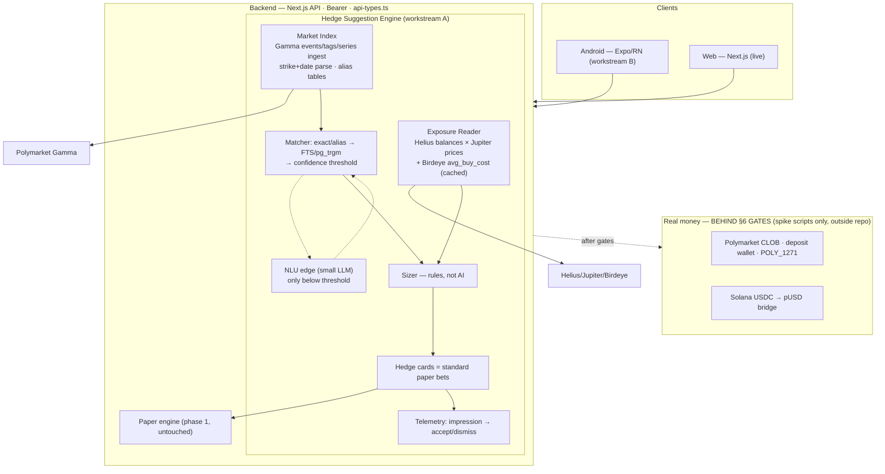

# Hedge Fun — Phase 2 spec (Android + hedge engine on Polymarket)

> Status: **locked 2026-07-17** by the owner after advisor review (GPT Sol 5.6 + Kimi K3, both
> repo-grounded). This doc is the execution contract for phase 2. Sibling docs:
> [`hedge-fun-july-mvp-spec.md`](./hedge-fun-july-mvp-spec.md) (phase 1, as built),
> [`android-readiness.md`](./android-readiness.md), [`share-and-android.md`](./share-and-android.md).

---

## 0. Scope

1. **Android app** (Expo / React Native) — a second client on the same backend API and the same
   Privy identity. No backend fork.
2. **Hedge mechanics** (client request) — wallet hedge + life-event hedge, suggestions matched
   against real Polymarket markets. Ships as **paper bets** through the existing engine until the
   real-money gates (§6) clear.
3. **Real-money rails** (Polymarket CLOB) — **gated**. No real-money code enters this repo until
   §6 confirmations land; de-risking happens in throwaway spike scripts outside the repo.

Liquidity provider decision: **Polymarket** (over Kalshi) — final.

## 1. Decisions (locked, with rationale)

| # | Decision | Rationale |
|---|----------|-----------|
| D1 | **No LLM in the decision loop.** Matching, side selection, sizing, execution — deterministic code. | Polymarket metadata is structured (verified live: tag slugs, event tickers, strike+date in slugs/questions). LLM enumeration (the client's v1 pattern) is slow, expensive, un-QA-able. Advisor consensus. |
| D2 | **LLM = one thin NLU edge only**: a single constrained small-model call mapping free-text → `{category, entities, intent}`, invoked **only** when alias/FTS matching falls below a confidence threshold (scenario 2 free-text path). Logged and replayable. | The one vocabulary problem scripts can't close ("мой клуб" → team alias). ~1 cheap call per hedge request worst-case; LLM API savings fund Birdeye (owner decision). |
| D3 | **Exposure = current market value**, not cost basis. Balances via Helius, prices via Jupiter. | On-chain data cannot reliably reconstruct purchase price (CEX transfers, LPs, airdrops). Both advisors flagged independently. |
| D4 | **`avg_buy_cost` narrative via Birdeye Wallet PnL** (`/wallet/v2/pnl*`), cached in Postgres with TTL, graceful degradation (card renders without the "you bought at $X" line if Birdeye is down). | Solved-as-a-service; free Standard tier covers dev+pilot (30k CU/mo; summary=30 CU, details=40 CU), prod = Lite $39/mo. Wallet APIs are beta and capped 5 rps / 75 rpm on every tier → cache is mandatory, never call synchronously per screen. Fallbacks: Vybe / Cielo / DIY over Helius Enhanced Transactions. |
| D5 | **Custody = client-side silent signing** via Privy embedded wallet: EIP-712 CLOB orders signed on-device with no per-swipe modal; no server-held keys or session delegation. Non-custodial. | Server-side delegation = de-facto custodial (regulatory tail); per-swipe modals kill the swipe UX. Privy supports configurable confirmation UX. |
| D6 | **Hedge cards are standard paper bets** — same `Bet` row, same settlement poller, no separate hedge ledger. | Validates matching quality + conversion with zero custody exposure; weekly shippable. |
| D7 | **Android lives in `mobile/`** in this repo; copies `api-types.ts`, `time.ts`, and the pure builders from `share.ts` (header comment: "copied from src/lib — sync manually"). No monorepo tooling. | Per android-readiness.md: 3 files is a copy, not infrastructure. `share.ts` still contains `process.env`/`window` (Sol's finding) — the **pure builders** transfer, the opener is reimplemented natively. |
| D8 | **Variable stake enters the API contract** (`stakeCents` on hedge bets; regular deck swipes stay fixed $10). | 5–10% notional sizing cannot be expressed in a fixed-$10 flow (Sol's finding on `api-types.ts`). |
| D9 | **Swipe is never blocked by signing or submission** (owner decision 2026-07-18). The swipe gesture resolves instantly and the user keeps swiping; everything after the gesture is an async background pipeline. Paper mode already works this way in both clients (optimistic advance: `src/app/page.tsx`, `mobile/src/screens/DeckScreen.tsx`) — real money MUST preserve it: swipe → enqueue an order intent (market, side, stake, price snapshot) → background worker signs (Privy silent, D5) and submits to the CLOB → per-bet status (`signing → submitting → open/filled/failed`) surfaces in Results, never as a blocking modal. Failures (signing error, network, CLOB reject) show a non-blocking notice with retry; price protection = marketable-limit orders with a max-slippage bound — if the price moved past the bound between gesture and submit, auto-cancel + notify, never fill silently at a worse price. | A signature per swipe is 100ms–1s+ of latency; putting it in the gesture path kills the core UX. The async pipeline is also where slippage policy and retries naturally live. |

## 2. Hedge scenarios (functional)

### S1 — Wallet hedge
- Input: a Solana address (pasted or connected; read-only — we never ask for keys).
- Majors (SOL; wrapped BTC/ETH if present): offer a **5–10% of current notional** position in the
  opposite direction on a matching Polymarket market ("SOL will NOT be above $X by <date>" /
  "below $Y by <date>"). Strike + deadline parsed deterministically from market slug/question.
- Long-tail SPL (no direct markets): sum current value → offer **~3% into a SOL short** as a proxy
  hedge. UI copy must label it a *proxy* (basis risk), not a hedge.
- The "you bought at $X" line comes from Birdeye `avg_buy_cost` when available (D4).
- Sizing percentages are **product rules**, not hedge math — copy must not claim equivalence.

### S2 — Life-event hedge
- **Primary UX: structured pickers** — team / league / event lists built from Polymarket's own
  sports & entertainment metadata (same poller cadence as the deck; lists churn daily).
- **Secondary: free-text** ("иду на фильм X") → alias/FTS match → below threshold → NLU edge (D2)
  → deterministic search + ranking.
- **Fallback** (client-specified): "в твоей уникальной ситуации сложно перестраховаться" + 3
  random markets — labeled **discovery**, never presented as a hedge.
- Scope guard (client-approved): blue-chip crypto + sports (+ entertainment when metadata allows).

## 3. Architecture (bird's-eye)

Key invariants:
1. LLM never selects side, size, or execution (D1/D2).
2. Hedge suggestions settle through the existing paper pipeline (D6).
3. Real-money code stays out of the repo until §6 clears.
4. Server remains the single source of truth; clients render `/api/*` responses.

## 4. Workstreams & ownership

| Workstream | Executor | Owned paths | Must not touch |
|---|---|---|---|
| **A — hedge engine (server)** | Opus 4.8 | `src/lib/**` (new hedge modules), `src/app/api/hedge/**`, `prisma/**` (migrations), `scripts/**`, `src/lib/api-types.ts` | `src/app/page.tsx` & web screens (until engine lands), `mobile/**` |
| **B — Android client** | Kimi K3 | `mobile/**` only | everything outside `mobile/` (copies contract files in, never edits originals) |

Contract rule (from android-readiness.md): every new request/response shape lands in
`api-types.ts` (workstream A owns it), every schema change is a committed Prisma migration.
Workstream B consumes copies.

## 5. Data model & env additions (workstream A detail)

- `HedgeWallet` — user_id, address, created_at (read-only address link; multiple allowed later).
- `WalletSnapshot` — cached exposure + Birdeye PnL per address, `fetchedAt` TTL.
- `MarketMeta` — enrichment over the market cache: tags, event slug/ticker, series, parsed strike
  (integer cents), parsed deadline, liquidity/volume (for ranking).
- `HedgeSuggestionEvent` — suggestion id, user, market, kind (S1-major / S1-proxy / S2 / fallback),
  proposed stake, event (impression / accept / dismiss), created_at. **Without this we learn
  nothing** (advisor consensus).
- Bets from hedge cards: standard `Bet` rows + `stakeCents` (D8) + suggestion back-reference.
- Env: `HELIUS_API_KEY`, `BIRDEYE_API_KEY`, `NLU_API_KEY` (NLU edge only, any OpenAI-compatible provider), all in
  `.env.example` with comments. Jupiter price API needs no key at our volumes.

## 6. Real-money gates (all external; tracked, not built)

1. **Polymarket devs, in writing**: per-user deposit wallets + `POLY_1271` signature path for
   embedded wallets; builder attribution applies to our integration (fees ≤1% taker / 0.5% maker,
   revocable — never budgeted as guaranteed).
2. **Privy**: silent EIP-712 signing from React Native verified on a spike.
3. **Google Play**: real-money prediction-market policy for the target countries (gambling
   certification). Unresolved — nobody has dug this; it can reshape distribution.
4. **Geofencing**: enforced on the original user IP at onboarding *and* order time.

Spike script (outside repo, throwaway): funded Polygon test wallet → L2 CLOB creds → $1 order
place / part-fill / cancel / redeem → Solana USDC → pUSD deposit dry-run.

## 7. Risks (top, from advisor review)

1. **Custody/regulatory fork is existential** for real money; it is a client-owned decision and it
   is on the critical path now (D5 sets direction; §6 confirms it).
2. **Three projects, 1–2 devs**: Android, hedge engine, real-money de-risk. Weekly independently
   demoable acceptance gates or nothing ships production-safe.
3. **Birdeye wallet-API beta** — hard 5 rps / 75 rpm; cache-or-die (D4), degrade gracefully.
4. **Market churn** — sports metadata expires daily; picker lists get poller treatment, not a
   static import.
5. **Gamma ToS/rate tolerance** at commercial polling scale — verify before the suggestion engine
   depends on it.
